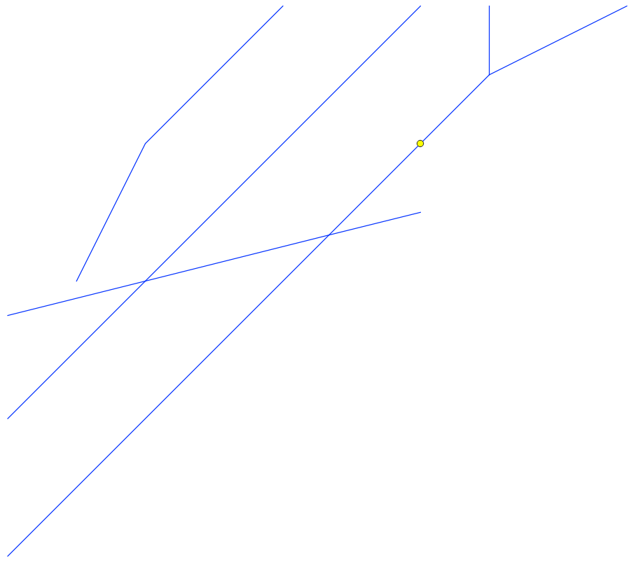

# Geoserver WPS Network Course

Compute the course into a network from a geometry.

This WPS process was tested on GeoServer 2.22

## Installation

Download [network_course_wps-2.22-SNAPSHOT.jar](target/network_course_wps-2.22-SNAPSHOT.jar) and put it in wps extension directory, in the same location that you put files like gs-web-wps-2.22.1.jar, gs-wps-core-2.22.1.jar, gt-process-geometry-28.1.jar and others.

## Usage

You can test geoserver-wps-network-course geoprocess by accessing to WPS request builder in Geoserver:

Looking for "gs:NetworkCourse" in "Choose process" combo:

And completing the requested parameters. Finally, clicking on "Execute process".:

Of course, you can call this geoprocess like any other, by using WPS standar from your application.

## How does it work

The objective of the geoprocess is to obtain from a network of geometries a sequence of geometries that are linked starting from an indicated point and walking towards a direction.

To do this, the following steps are executed:

- It starts from a network of geometries indicated in the parameter "geom":
  

  > It is important to mention that the geometry network must be formed following the topographic rule of not having loose lines and cutting the lines at each of their intersections with another.

- Generates a buffer over the geometry indicated in the "intersectionGeometry" parameter, whose radius will be the value indicated in the "tolerance" parameter:
  
  

- Obtain the part of the network that intersects the geometry obtained in the previous point (buffer):
  

- From the intersection found, it begins to recursively intersect the result over the same network, but only takes those geometries that go in the direction indicated in the "directionResult" parameter:
  

## Geoprocess parameters

- geom: Feature collection containing all base geometries of the network. In the example above, this is the lines network drawing in blue color.

- intersectionGeometry: Geometry used by the geoprocess to find the starting point. This geometry is used to make the first intersection with the network indicated in the parameter geom.

- tolerance: Tolerance value used for the intersection between the intersectionGeometry and geom parameters. Must be entered in the network unit of measure.

- directionResult: indicates the direction in which the network will be traversed and, consequently, will be the address of the result. By default the geoprocess is executed with direction nacent_to_mouth.
